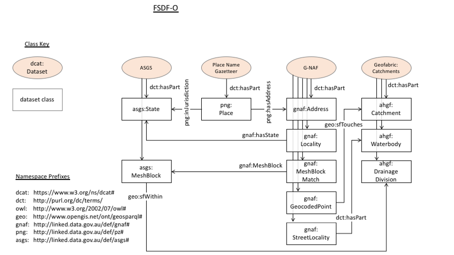

# FSDF Ontology
An ontology describing the data class-level relationships between Semantic Web versions of [Foundational Spatial Data Framework (FSDF)](http://fsdf.org.au) datasets.

This ontology is an 'upper ontology' in that it serves as a high-level model for other Semantic Web-modelled datasets to map 'up' to. This is so that there is a path for testing interoperability between future FSDF Semantic Web datasets.

The ontology contains instances of FSDF datasets delivered using Semantic Web technologies, such as the [G-NAF](http://gnafld.net) and also classes found within those datasets. It is thus both a collection of data instances and also a data model.

## Status
This version of this ontology, 0.5, it is *not* considered production ready. It is instead suitable for testing out the general principles of an upper ontology for FSDF and for exploring the relationships between datasets. Many (most) of the relationships are anticipated but not anticipated yet - June 2018.

Note also that the URIs indicated for many datasets that use the domain name `linked.data.gov.au` do not yet resolve but are expected to in late July, 2018 one the namespace has been formally activated by the [Australian Government Linked Data Working Group](http://linked.data.gov.au).

Due to the early stage of development of this ontology, there are many unanswered questions about its use. See the developing list of such questions:

* [Issue tracker of unanswered questions about FSDF-O use](https://github.com/geoscienceaustralia/fsdf-ont/issues)

## Repository contents
This repository contains:

* [fsdf.ttl](fsdf.ttl) - the technical ontology file
* [fsdf.html](fsdf.html) - the HTML web page version of the technical ontology. See <test.linked.data.gov.au/def/fsdf> for the online version.
* [fsdf.png](fsdf.png) - an onverview diagram of the FSDF-O classes and properties
* [examples/](examples/examples.md) - examples of how the ontology relates FSDF datasets
* [docs/](docs/) - supporting documentation such as product guides to Semantic Web versions of the datasets the FSDF-O relates

## How to get started
***If you don't know what an ontology is***:  
Contact the Australian Government Linked Data Working Group:

* <http://linked.data.gov.au>

***If you do know what an ontology is but don't know what the FSDF-O can do***:  
See the [examples/](examples/) folder with descriptions of how the ontology works, its relationship to systems like [LINK](https://link.fsdf.org.au) and how it relates FSDF datasets.

***If you want a quick overview of FSDF-O***:  
See the image below (Figure 1).

***If you just want the official documentation of the FSDF-O***:  
See [fsdf.html](fsdf.html), the HTML web page version of the technical ontology. Note it is hosted online at a temporary namespace for now at:

* <http://test.linked.data.gov.au/def/fsdf>

***If you are a modeller***:  
Use [fsdf.ttl](fsdf.ttl), the technical ontology file, in an ontology editor such as [Protégé](http://protege.stanford.edu/).

## Overview diagram
Here, Figure 1, is a quick view of the overall FSDF-O.

  
**Figure 1**: Image of the FSDF-O classes and properties

## License
The content of this API is licensed for use under the [Creative Commons 4.0 License](https://creativecommons.org/licenses/by/4.0/). See the [license deed](LICENSE) all details.

## Citation
If you wish to cite this ontology, please do so like this:

Geoscience Australia (2018) "FSDF Ontology". Web Ontology Language ontology for the Foundational Spatial Data Framework of Australia. http://test.linked.data.gov.au/def/fsdf

## Contacts
**Simon Costello**  
Geoscience Australia / Chair, Intergovernmental Committee on Surveying & Mapping  
*Product owner*  
<simon.costello@ga.gov.au>  

Primary Contact person:  
**Rob Newham**  
Geoscience Australia  
*Technical Owner*  
<robert.newham@ga.gov.au>  

**Nicholas Car**  
CSIRO Land & Water  
*Ontology creator*  
<nicholas.car@csiro.au>
