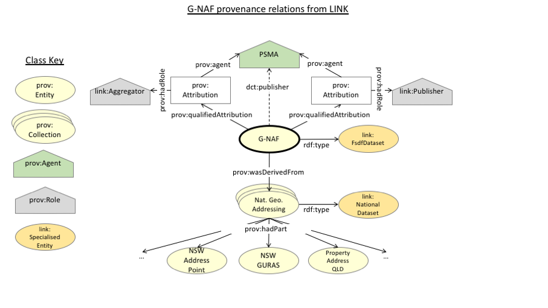
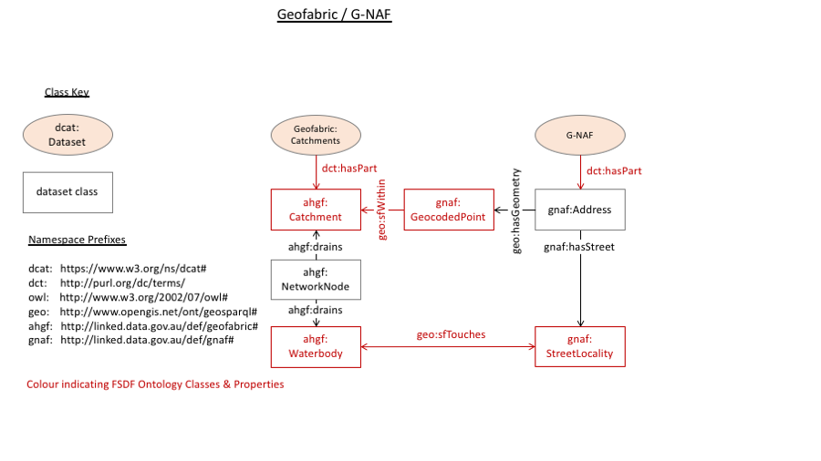
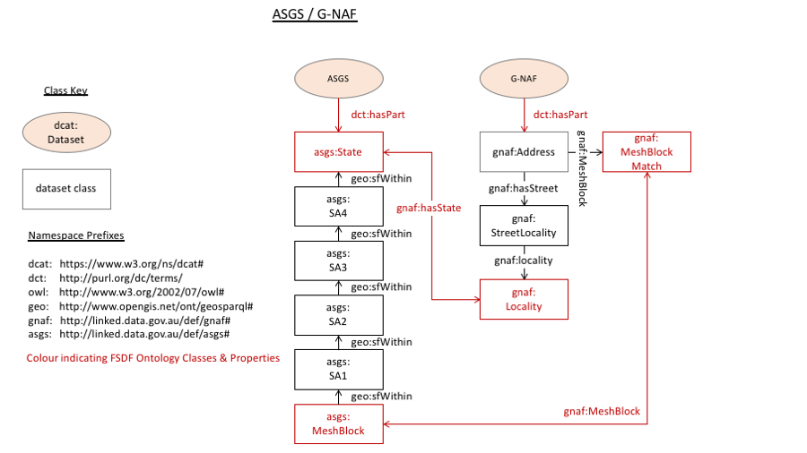
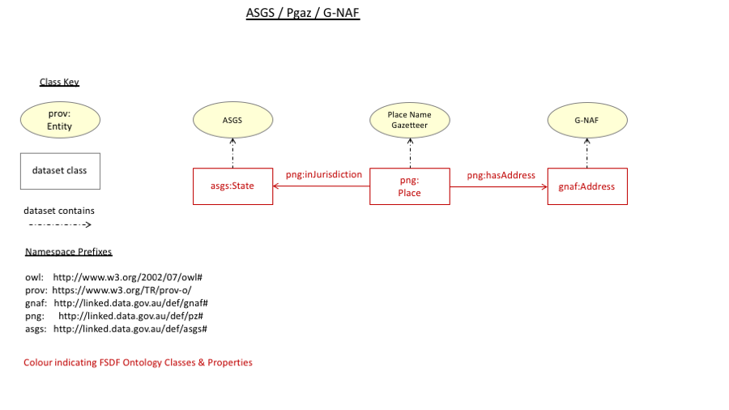

# Examples
#### Of how the FSDF-O works

## E.G. 1: G-NAF & Geofabric relations
We already have a prototype Semantic Web version of the Geocoded National Address File (G-NAF, see <http://gnafld.net>) and we have previously had a Semantic Web version of the Geofabric (see <http://www.bom.gov.au/water/geofabric/>). Without going into the details of the structure of these datasets, something a serious user of them would surely need to do, how can we know about their relationships, if any, in accordance with FSDF?  

There are two answers to this. One involves the data stored in the [LINK](http://link.fsdf.org.au) and, hopefully soon, distributed data stored within various jurisdictional catalogues in Australia. This first answer will allow us to discover if there are any dependency or governance relationships between the G-NAF & Geofabric via provenance information: is the G-NAF dependent on anything that the Geofabric is, or vice versa? Are either dependent on the other? Are they both dependent on any common organisations?

  
**Figure 1**: G-NAF dataset provenance relationships from [LINK](https://link.fsdf.org.au).

  
**Figure 2**: Geofabric provenance relationships from [LINK](https://link.fsdf.org.au). Note there are no ancestors or Agents (organisations) in common with the G-NAF as shown in Figure 1.

The second way we can look for relationships is via the classes of data *within* the datasets: are any types of items in the G-NAF able to be referenced by those in Geofabric, or vice versa? The FSDF-O requires that any such possible relationships are recorded within it, as well as likely within the individual dataset's models.

Figure 3 shows the known relationships between the G-NAF FSDF Dataset and the FSDF's Geofabric Catchments product. Note that while a possible or allowable relationship may be formed between a `gnaf:GeocodePoint` and a `ahgf:Catchment` using the GeoSPARQL property `sfWithin`, this does not mean that anyone has yet computed such data, only that it is possible to do so. Additionally, the `ahgf:WaterBody` to `gnaf:StreetLocality` relation of `geo:sfTouches` while possible to determine has not, at this point, been computed for any particular water body or street locality. Again, Figure 3 indicates only that this *is* possible.

  
**Figure 3**: G-NAF & Geofabric class relationships

## E.G. 2: ASGS & G-NAF relations
Data within the [Australian Bureau of Statistics](http://test.linked.data.gov.au/org/O-000928)' [Australian Statistical Geography Standard (ASGS)](https://link.fsdf.org.au/fsdf-dataset/australian-statistical-geographical-standard-boundaries) can be related to data within the G-NAF as per the class relations in Figure 4.

  
**Figure 4**: ASGS & G-NAF class relationships

## E.G. 3: ASGS, G-NAF & Place Name Gazetteer relations
Data within the [National Gazetteer of Australia](https://link.fsdf.org.au/dataset/national-gazetteer-australia), can be related to data within the ASGS and the G-NAF as per the class relations in Figure 5.

  
**Figure 5**: PNG, ASGS & G-NAF class relationships
